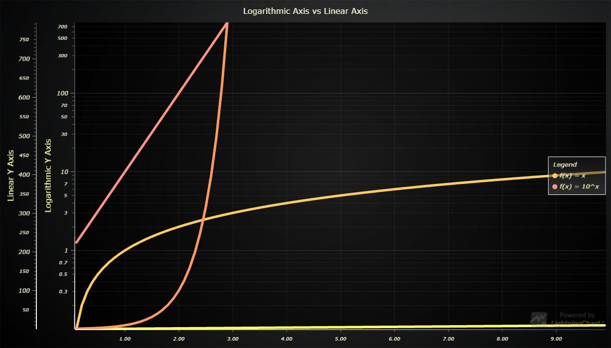

# JavaScript Logarithmic Line Chart



This demo application belongs to the set of examples for LightningChart JS, data visualization library for JavaScript.

LightningChart JS is entirely GPU accelerated and performance optimized charting library for presenting massive amounts of data. It offers an easy way of creating sophisticated and interactive charts and adding them to your website or web application.

The demo can be used as an example or a seed project. Local execution requires the following steps:

- Make sure that relevant version of [Node.js](https://nodejs.org/en/download/) is installed
- Open the project folder in a terminal:

        npm install              # fetches dependencies
        npm start                # builds an application and starts the development server

- The application is available at *http://localhost:8080* in your browser, webpack-dev-server provides hot reload functionality.


## Description

This example showcases creation of logarithmic axes, highlighting the functional differences between linear and logarithmic axes using *line series*.

Logarithmic Axis can be created by supplying `type: 'logarithmic'` argument when the Axis is created:

```typescript
const chart = lightningChart().ChartXY({
    // Specify default Y Axis as logarithmic (10).
    defaultAxisY: {
        type: 'logarithmic',
        base: 10,
    }
})

// Add second Y Axis that is also logarithmic (Math.E).
const axis = chart.addAxisY({
    type: 'logarithmic',
    base: 'e',
})
```


## API Links

* [XY cartesian chart]
* [Data patterns]
* [Color HEX factory]
* [Solid Line style]
* [Solid Fill style]
* [UI origins]


## Support

If you notice an error in the example code, please open an issue on [GitHub][0] repository of the entire example.

Official [API documentation][1] can be found on [Arction][2] website.

If the docs and other materials do not solve your problem as well as implementation help is needed, ask on [StackOverflow][3] (tagged lightningchart).

If you think you found a bug in the LightningChart JavaScript library, please contact support@arction.com.

Direct developer email support can be purchased through a [Support Plan][4] or by contacting sales@arction.com.

[0]: https://github.com/Arction/
[1]: https://www.arction.com/lightningchart-js-api-documentation/
[2]: https://www.arction.com
[3]: https://stackoverflow.com/questions/tagged/lightningchart
[4]: https://www.arction.com/support-services/

© Arction Ltd 2009-2020. All rights reserved.


[XY cartesian chart]: https://www.arction.com/lightningchart-js-api-documentation/v3.0.1/classes/chartxy.html
[Data patterns]: https://www.arction.com/lightningchart-js-api-documentation/v3.0.1/globals.html#datapatterns
[Color HEX factory]: https://www.arction.com/lightningchart-js-api-documentation/v3.0.1/globals.html#colorhex
[Solid Line style]: https://www.arction.com/lightningchart-js-api-documentation/v3.0.1/classes/solidline.html
[Solid Fill style]: https://www.arction.com/lightningchart-js-api-documentation/v3.0.1/classes/solidfill.html
[UI origins]: https://www.arction.com/lightningchart-js-api-documentation/v3.0.1/globals.html#uiorigins

